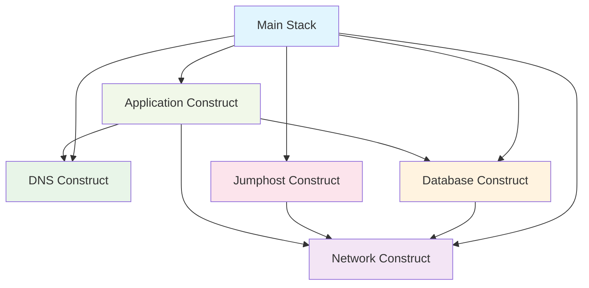

# Project Structure and Organization

This document explains the organized CDK project structure with reusable constructs.

## 📁 **Directory Structure**

```
lib/
├── ecs-project-stack.ts          # Main stack orchestrator
└── constructs/                   # Reusable constructs
    ├── index.ts                   # Construct exports
    ├── network-construct.ts       # VPC and networking
    ├── dns-construct.ts           # Route53 and SSL certificate
    ├── database-construct.ts      # RDS PostgreSQL
    ├── jumphost-construct.ts      # EC2 troubleshooting instance
    └── application-construct.ts   # ECS service and ECR
```

## 🏗️ **Construct Organization**

### **Main Stack (`ecs-project-stack.ts`)**
- **Purpose**: Orchestrates all constructs and defines their relationships
- **Responsibilities**: 
  - Creates construct instances
  - Configures inter-construct dependencies
  - Defines stack outputs
  - Minimal business logic

### **Network Construct (`network-construct.ts`)**
- **Purpose**: Creates VPC and networking infrastructure
- **Features**:
  - 3-tier subnet architecture (public/private/database)
  - Configurable AZ and NAT gateway count
  - Proper DNS and hostname support

### **DNS Construct (`dns-construct.ts`)**
- **Purpose**: Manages DNS and SSL certificates
- **Features**:
  - Route53 hosted zone lookup
  - SSL certificate creation and validation
  - A record creation helper method

### **Database Construct (`database-construct.ts`)**
- **Purpose**: Creates RDS PostgreSQL with security
- **Features**:
  - Configurable instance type and storage
  - Automated credentials via Secrets Manager
  - Security group with connection helpers
  - Enhanced monitoring and performance insights

### **Jumphost Construct (`jumphost-construct.ts`)**
- **Purpose**: Creates EC2 instance for troubleshooting
- **Features**:
  - Pre-configured with useful tools
  - SSH key pair management
  - Session Manager support
  - Helper scripts for common tasks

### **Application Construct (`application-construct.ts`)**
- **Purpose**: Creates ECS service and related resources
- **Features**:
  - ECR repository with lifecycle policies
  - ECS Fargate service with auto-scaling
  - Load balancer with health checks
  - CloudWatch logging

## 🔧 **Construct Benefits**

### **1. Reusability**
```typescript
// Easy to reuse in multiple stacks
const network = new NetworkConstruct(this, 'Network', {
  maxAzs: 3,
  natGateways: 2
});
```

### **2. Configurability**
```typescript
// Flexible configuration options
const database = new DatabaseConstruct(this, 'Database', {
  vpc: network.vpc,
  instanceType: ec2.InstanceType.of(ec2.InstanceClass.T3, ec2.InstanceSize.SMALL),
  deletionProtection: true  // Production setting
});
```

### **3. Encapsulation**
```typescript
// Clean interfaces hide complexity
database.allowConnectionsFrom(jumphost.securityGroup);
```

### **4. Testing**
Each construct can be unit tested independently:
```typescript
// test/constructs/network-construct.test.ts
test('Network construct creates VPC with correct subnets', () => {
  // Test implementation
});
```

## 🎯 **Usage Examples**

### **Basic Deployment**
```typescript
const app = new cdk.App();
new EcsProjectStack(app, 'MyStack', {
  domainName: 'mycompany.com',
  subdomainName: 'api'
});
```

### **Development Environment**
```typescript
new EcsProjectStack(app, 'DevStack', {
  domainName: 'dev.mycompany.com',
  subdomainName: 'api'
});
```

### **Production Environment**
```typescript
new EcsProjectStack(app, 'ProdStack', {
  domainName: 'mycompany.com',
  subdomainName: 'api'
});
```

## 🔄 **Construct Dependencies**



## ⚙️ **Configuration Options**

### **Stack Level**
```typescript
interface EcsProjectStackProps extends cdk.StackProps {
  readonly domainName?: string;        // Default: 'oazis.site'
  readonly subdomainName?: string;     // Default: 'spring'
}
```

### **Construct Level**
Each construct has its own configuration interface:

```typescript
// Network options
interface NetworkConstructProps {
  readonly maxAzs?: number;          // Default: 2
  readonly natGateways?: number;     // Default: 1
}

// Database options
interface DatabaseConstructProps {
  readonly databaseName?: string;     // Default: 'springbootdb'
  readonly instanceType?: ec2.InstanceType;
  readonly deletionProtection?: boolean;
}

// Application options
interface ApplicationConstructProps {
  readonly desiredCount?: number;     // Default: 2
  readonly cpu?: number;              // Default: 512
  readonly memoryLimitMiB?: number;   // Default: 1024
}
```

## 🧪 **Testing Strategy**

### **Unit Tests**
```typescript
// test/constructs/database-construct.test.ts
describe('DatabaseConstruct', () => {
  test('creates RDS instance with correct configuration', () => {
    const app = new cdk.App();
    const stack = new cdk.Stack(app, 'TestStack');
    const vpc = new ec2.Vpc(stack, 'TestVpc');
    
    const database = new DatabaseConstruct(stack, 'TestDatabase', {
      vpc: vpc
    });
    
    const template = Template.fromStack(stack);
    template.hasResourceProperties('AWS::RDS::DBInstance', {
      Engine: 'postgres'
    });
  });
});
```

### **Integration Tests**
```typescript
// test/ecs-project-stack.test.ts
describe('EcsProjectStack', () => {
  test('creates complete infrastructure', () => {
    const app = new cdk.App();
    const stack = new EcsProjectStack(app, 'TestStack');
    
    const template = Template.fromStack(stack);
    
    // Verify all major components
    template.hasResourceProperties('AWS::EC2::VPC', {});
    template.hasResourceProperties('AWS::RDS::DBInstance', {});
    template.hasResourceProperties('AWS::ECS::Cluster', {});
  });
});
```

## 📈 **Benefits of This Organization**

1. **🔧 Maintainability**: Each construct has a single responsibility
2. **🔄 Reusability**: Constructs can be used in multiple stacks
3. **🧪 Testability**: Each construct can be tested independently
4. **📚 Readability**: Clear separation of concerns
5. **⚙️ Configurability**: Flexible configuration options
6. **🚀 Scalability**: Easy to add new constructs or modify existing ones

## 🔮 **Future Enhancements**

- **Multi-environment support**: Different configurations per environment
- **Monitoring construct**: Centralized CloudWatch dashboards and alarms
- **Security construct**: Centralized security policies and rules
- **Backup construct**: Automated backup strategies across resources
- **Cost optimization construct**: Automated cost optimization policies
