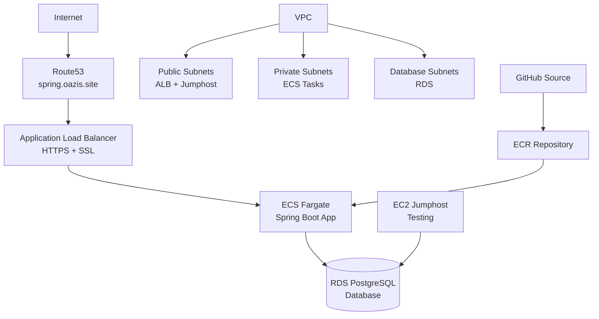

# Spring Boot ECS Project

This CDK project automatically builds and deploys a complete production-ready Spring Boot application infrastructure on AWS.

## 🏗️ **Architecture**

- **🌐 Custom Domain**: `spring.oazis.site` with SSL certificate
- **🔒 HTTPS**: Automatic SSL/TLS termination
- **🐳 Container**: Auto-build from GitHub source
- **⚖️ Load Balancer**: Application Load Balancer with health checks
- **🚀 ECS Fargate**: Serverless container deployment with auto-scaling
- **🗄️ Database**: RDS PostgreSQL with automated backups
- **🖥️ Jumphost**: EC2 instance for troubleshooting and testing
- **📊 Monitoring**: CloudWatch logs and metrics

## 🚀 **Quick Start**

```bash
# One-command deployment
./deploy.sh

# Or step by step
npm install && npm run build && cdk deploy
```

## 🔗 **Access Points**

- **🌐 Application**: https://spring.oazis.site
- **🔧 Management**: `./access.sh` (interactive helper)
- **📝 Logs**: CloudWatch `/ecs/spring-boot-app`

## 📚 **Documentation**

- **[DEPLOYMENT.md](./DEPLOYMENT.md)**: Step-by-step deployment guide
- **[INFRASTRUCTURE.md](./INFRASTRUCTURE.md)**: Complete infrastructure overview
- **[CONFIGURATION.md](./CONFIGURATION.md)**: Environment configuration examples
- **[ORGANIZATION.md](./ORGANIZATION.md)**: Project structure and construct organization

## 🛠️ **Management Scripts**

```bash
./deploy.sh    # Deploy everything
./access.sh    # Interactive access helper
./cleanup.sh   # Clean up all resources
```

## 🏛️ **Infrastructure Components**



## 💰 **Estimated Monthly Cost**

| Component | Cost | Description |
|-----------|------|-------------|
| ECS Fargate | $25-50 | 2 tasks, auto-scaling |
| RDS PostgreSQL | $15-20 | t3.micro instance |
| Application Load Balancer | $22 | Fixed cost |
| NAT Gateway | $45 | Fixed cost |
| EC2 Jumphost | $8 | t3.micro instance |
| Route53 | $0.50 | Hosted zone |
| **Total** | **~$115-145** | Per month |

## 🔐 **Security Features**

- **🛡️ Network Isolation**: 3-tier VPC architecture
- **🔒 SSL/TLS**: End-to-end encryption
- **🔑 Secrets Management**: AWS Secrets Manager for DB credentials
- **🚫 Private Database**: No internet access
- **👤 IAM Roles**: Least privilege access
- **🔐 Security Groups**: Proper port restrictions

## CDK Commands

* `npm run build`   compile typescript to js
* `npm run watch`   watch for changes and compile
* `npm run test`    perform the jest unit tests
* `npx cdk deploy`  deploy this stack to your default AWS account/region
* `npx cdk diff`    compare deployed stack with current state
* `npx cdk synth`   emits the synthesized CloudFormation template

## Configuration

Update the following in `lib/ecs-project-stack.ts`:
- Container image URI
- Environment variables
- CPU/Memory allocation
- Scaling parameters
# Testing CI/CD
